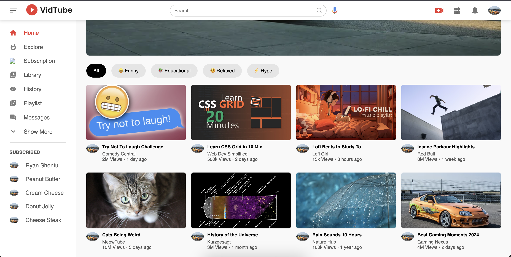

# 📺 Video Streaming Application

A fully responsive, dynamic video streaming platform inspired by YouTube. This application simulates a Single Page Application (SPA) experience using Vanilla JavaScript, allowing users to browse, search, and watch videos with a seamless interface.

**[🔴 Live Demo](https://ryanshentu.github.io/video_platform/)**



## 🚀 Key Features

* **Dynamic Content Loading:** Fetches video data (titles, thumbnails, stats) from a local JSON database using the **Fetch API**.
* **Video Playback System:** Integrated YouTube IFrame API to stream content directly within the application.
* **Smart Routing:** specific video pages are rendered dynamically using **URL Parameters** (`?id=2`), eliminating the need for separate HTML files for every video.
* **"Up Next" Logic:** The sidebar algorithmically filters content to show recommended videos, automatically excluding the video currently being watched.
* **Responsive Design:** Mobile-first architecture using **CSS Flexbox & Grid**, featuring a collapsible sidebar and adaptive video player layout.
* **Search Functionality:** Real-time filtering of video titles and channels.

## 🛠️ Technologies Used

* **Frontend:** HTML5, CSS3, JavaScript (ES6+)
* **Data Handling:** JSON, Fetch API
* **Version Control:** Git, GitHub
* **Deployment:** GitHub Pages

## 🧠 What I Learned

Building this project deepened my understanding of modern frontend architecture:

1.  **Asynchronous JavaScript:** I moved away from hardcoded HTML to fetching data asynchronously, handling Promises with `async/await`.
2.  **DOM Manipulation:** Learned how to generate HTML elements in a loop based on JSON data.
3.  **State Management:** Managed the state of the application (Dark Mode, Sidebar Toggle) using CSS variables and class toggling.
4.  **URLSearchParams:** Solved the challenge of passing data between pages without a backend server.

## 💻 How to Run Locally

Since this project uses the `fetch()` API, it requires a local server to avoid Cross-Origin Resource Sharing (CORS) errors.

1.  **Clone the repository**
    ```bash
    git clone [https://github.com/ryanshentu/video_platform.git](https://github.com/ryanshentu/video_platform.git)
    ```
2.  **Open in VS Code**
    ```bash
    cd video_platform
    code .
    ```
3.  **Launch Server**
    * Install the "Live Server" extension in VS Code.
    * Right-click `index.html` and select **"Open with Live Server"**.

## 📬 Contact

**Ryan Shentu**
* [GitHub Profile](https://github.com/ryanshentu)
* [LinkedIn](https://www.linkedin.com/in/ryan-shentu-35a402322/)